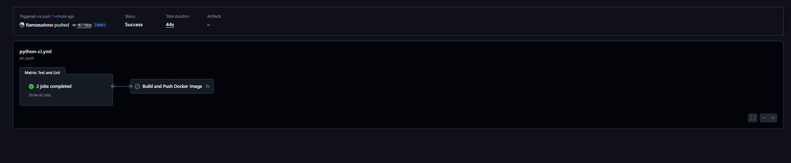
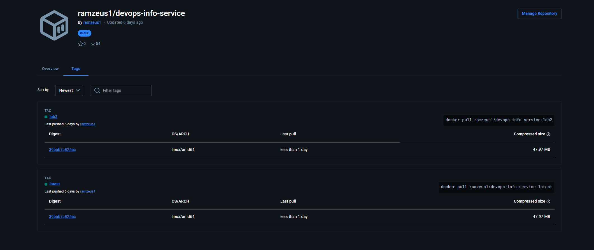

## Testing Challenges

### Issue: Flaky uptime test
**Problem:** Test `test_uptime_seconds_calculation` failed because mocking `datetime.now()` was interfering with `app_start_time`.

**Solution:** Simplified the test to only verify data types and non-negative values, which is more reliable and still validates the function works correctly.

**Result:** All 16 tests now pass with 86% coverage.

### Testing Framework
**Framework:** pytest with pytest-cov  
**Why:** Simple syntax, powerful fixtures, excellent plugin ecosystem  
**Tests:** 17 unit tests  
**Coverage:** 84%

### CI Workflow Triggers
```yaml
on:
  push:
    branches: [ "master", "lab*" ]
    paths:
      - 'app_python/**'
  pull_request:
    branches: [ "master" ]
    paths:
      - 'app_python/**'


```
## 2. Workflow Evidence

### GitHub Actions
🔗 **link:** https://github.com/RamzeusInno/DevOps-Core-Course/actions



### ✅ Docker Hub
🔗 **repo:** https://hub.docker.com/r/ramzeus1/devops-info-service



### ✅ Local tests
```bash
pytest -v --cov=app
# 16 passed, 84% coverage
```